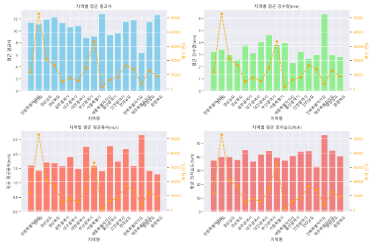
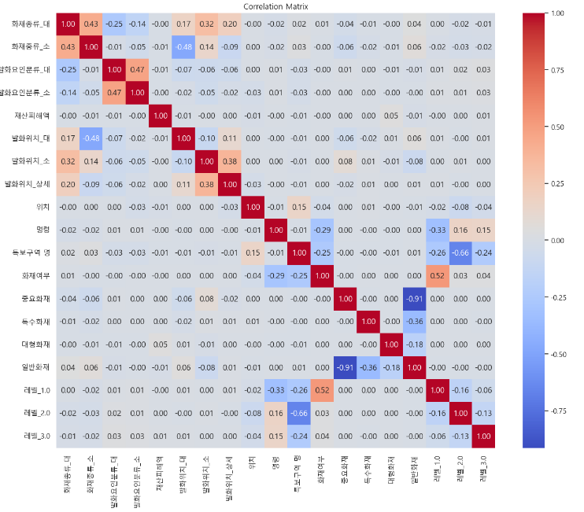
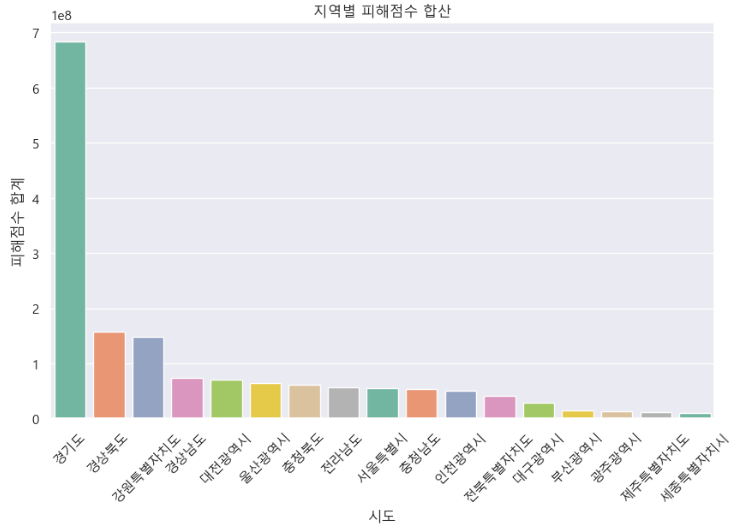
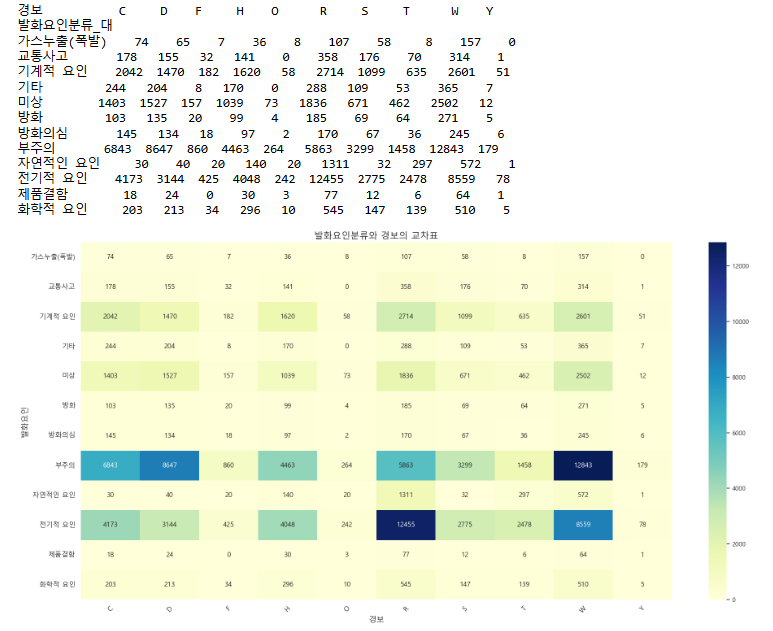
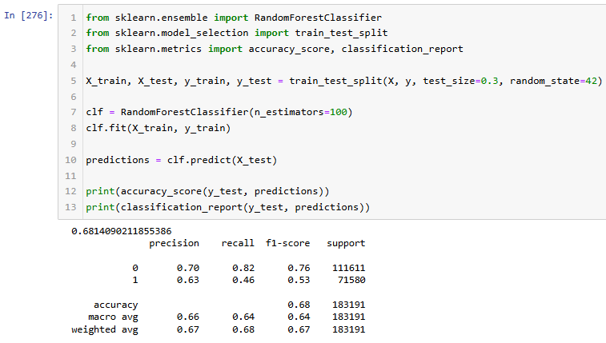

# 2024 날씨 빅데이터 콘테스트
https://bd.kma.go.kr/contest/main.do

기상현상과 화재발생에 대한 상관분석

 

## 1. 배경 & 목적

- 배경

    기후 변화와 함께 기상 조건이 다양한 사회적 현상에 미치는 영향이 증가하고 있습니다. 특히, 높은 온도, 강한 바람, 낮은 습도와 같은 기상 요소들은 화재 발생 가능성을 높이는 주요 요인으로 여겨지고 있습니다. 이러한 기상 조건들이 실제로 화재 발생에 얼마나 영향을 미치는지에 대한 명확한 분석이 요구되고 있으며, 이를 통해 화재 예방 및 대응책을 더욱 효과적으로 수립할 필요성이 커지고 있습니다. 기상청이 주관하는 빅데이터 콘테스트에서 "기상현상과 화재 발생 간의 상관분석" 주제를 통해 기상 요소와 화재 발생 간의 관계를 명확히 파악하고자 본 프로젝트를 진행하게 되었습니다.

- 목적

     - 기상 조건과 화재 발생 간의 상관관계 분석: 기상 데이터(온도, 습도, 강수량, 바람 세기 등)와 화재 데이터를 활용하여, 기상 조건이 화재 발생에 미치는 영향을 체계적으로 분석합니다. 이를 통해 특정 기상 조건이 화재 발생에 어떠한 영향을 미치는지 명확히 파악하는 것을 목표로 합니다.
     - 화재 예방 및 대응 체계 강화: 분석 결과를 바탕으로 화재 발생 위험성이 높은 기상 조건을 사전에 예측하고, 이를 통해 소방 인력 및 장비의 효율적 배치를 위한 근거 자료를 제공합니다. 이를 통해 화재 발생률을 낮추고, 발생 시 신속한 대응으로 피해를 최소화하는 것을 목표로 합니다.

 

## 2. 주최/주관 & 팀원

- 주최/주관: 기상청
- 팀원: 고병진, 김상호, 박용범, 범종원, 이주헌, 이한웅, 임태경, 홍기원

 

## 3. 프로젝트 기간

- 2024.05. ~ 2024.06. (3주)

 

## 4. 프로젝트 소개

이번 프로젝트의 목표는 기상현상과 화재 발생 간의 상관관계를 분석하여 기상 조건이 화재 발생에 미치는 영향을 이해하고, 이를 바탕으로 화재 예방 및 대응 체계를 강화하는 것입니다. 이를 위해 기상청에서 제공한 다양한 기상 데이터와 화재 발생 데이터를 결합하여 분석을 수행하였으며, 특히 화재 발생과 기상 조건 간의 통계적 상관관계를 도출하는 데 중점을 두었습니다.

- 데이터 이해 및 전처리
  - 데이터셋: 본 프로젝트에서는 기상청으로부터 제공된 기상 데이터와 화재 발생 데이터를 사용하였습니다. 기상 데이터에는 온도, 습도, 강수량, 바람 세기 등의 변수가 포함되었으며, 화재 발생 데이터에는 발생 시간, 지역, 원인, 피해 규모 등의 정보가 포함되었습니다.
  - 결측치 처리: 기상 데이터와 화재 발생 데이터에서 일부 결측치와 이상치가 발견되었습니다. 기상 데이터의 경우 결측치는 지역별 기상청 데이터를 활용하여 대체하였으며, 화재 발생 데이터의 경우 일부 결측치를 가진 레코드는 분석에서 제외하였습니다.
  - 데이터 병합: 기상 데이터와 화재 발생 데이터를 '지역'과 '시간'을 기준으로 병합하였습니다. 이를 통해 각 지역별로 동일한 시간대의 기상 조건과 화재 발생 여부를 연결하여 분석할 수 있도록 데이터셋을 구성하였습니다.
  - 변수 추가: 기상 조건이 화재 발생에 미치는 영향을 보다 명확히 분석하기 위해, 기온과 습도를 결합한 화재예측지표를 추가로 생성하였으며, 건조 여부, 계절, 시간대와 같은 변수도 새롭게 도출하였습니다.

- 데이터 시각화 및 분석

    시각화 과정에서는 Seaborn과 Matplotlib 라이브러리를 주로 사용하였으며, 다양한 차트와 그래프를 통해 데이터의 특성을 직관적으로 파악하였습니다.

    
    
    
    

    - 분석 내용

            - 기상 조건과 화재 발생: 기상 데이터와 화재 발생 데이터를 결합하여 분석한 결과, 기온, 강수량, 풍속, 습도 등 특정 기상 조건이 화재 발생과 유의미한 상관관계를 가지는 것으로 나타났습니다. 특히, 낮은 습도와 강한 바람이 화재 발생 확률을 높이는 주요 요인으로 분석되었습니다.
            - 지역별 화재 발생 요인: 지역별로 화재 발생 원인을 분석한 결과, 대부분의 화재는 부주의나 전기적 요인으로 발생하였으며, 자연 요인에 의한 화재는 상대적으로 드문 것으로 나타났습니다.
            - 특보와 화재 발생: 기상 특보 데이터와 화재 발생 데이터를 결합하여 분석한 결과, 강풍이나 건조 특보가 발효 중인 경우 화재 발생 가능성이 높은 것으로 확인되었습니다.
            

- 모델링

  기상 조건이 화재 발생에 미치는 영향을 예측하기 위해 머신러닝 모델을 사용하여 예측 모델을 구축하였습니다.

     - Random Forest

        - 모델 학습: 랜덤 포레스트(Random Forest) 알고리즘을 사용하여 화재 발생 여부를 예측하는 모델을 구축하였습니다. 100개의 결정트리(Decision Tree)로 구성된 랜덤 포레스트 모델을 학습 데이터로 학습시켰습니다.
        - 예측하기: 학습된 모델을 사용하여 테스트 데이터에 대한 화재 발생 여부를 예측하였습니다. 각 테스트 샘플에 대해 화재 발생 가능성을 산출하였습니다.
        - 평가하기: 모델의 성능을 평가하기 위해 예측 결과를 실제 화재 발생 데이터와 비교하였으며, 모델의 정확도(Accuracy)는 68%로 측정되었습니다.

        

   

- 결론

   이번 프로젝트에서는 기상 조건이 화재 발생에 미치는 영향을 분석하고, 이를 바탕으로 화재 예방 및 대응 방안을 강화하는 방법을 제시하였습니다.

    먼저, 기상 데이터와 화재 발생 데이터를 결합하여 상관분석을 수행한 결과, 특정 기상 조건이 화재 발생 가능성을 높이는 주요 요인임을 확인할 수 있었습니다. 특히, 낮은 습도와 강한 바람은 화재 발생 위험성을 높이는 중요한 요소로 나타났습니다.

    랜덤 포레스트 모델을 활용한 예측 분석을 통해, 기상 조건을 기반으로 화재 발생 가능성을 예측할 수 있는 모델을 구축하였으며, 이를 통해 화재 예방 및 대응 체계를 사전에 강화할 수 있는 가능성을 확인하였습니다.

    본 프로젝트의 결과는 화재 예방 정책 수립에 유용한 정보를 제공할 수 있으며, 기상 조건을 고려한 보다 효과적인 화재 관리 시스템을 구축하는 데 기여할 것으로 기대됩니다.

 

## 5. 프로젝트 담당 역할

- 데이터 전처리 및 병합

     - 데이터 정제 및 통합: 새로 생성된 데이터에서 지역명을 통일하기 위해 ‘강원영동’, ‘강원영서’를 ‘강원특별자치도’로 변경하였고, ‘시도명’과 ‘시군구명’을 결합하여 ‘지역’이라는 새로운 컬럼을 생성하였습니다. 또한, 화재발생시간을 ‘일시’, ‘월’, ‘시간’으로 분리하여 세 가지 컬럼을 추가하였습니다.
     - 불필요한 컬럼 제거 및 결측치 처리: 화재발생 데이터에서 대체 가능한 ‘화재발생시간’과 ‘연번’을 삭제하고, 결측치가 많은 ‘화재유형 소분류’ 컬럼을 ‘화재유형 대분류’와의 연관성 때문에 삭제하였습니다. 기상 데이터에서는 ‘시군구명’과 ‘AWS 지점 코드’를 삭제하여 데이터를 정제하였습니다.
     - 데이터 병합: 화재발생날짜를 기준으로 기상 데이터와 병합하였으며, ‘지역’과 ‘일시’를 기준으로 left 병합을 실행하여 화재발생 데이터와 기상 데이터를 통합하였습니다.

- 데이터 특성화 및 분석

     - 특성 컬럼 생성: 화재 발생에 영향을 줄 수 있는 다양한 변수들을 추가로 생성하였습니다. 예를 들어, 기상청의 건조 특보 기준을 참고하여 ‘건조여부’ 컬럼을 만들었으며, 계절별 화재 발생 여부를 분석하기 위해 ‘계절’ 컬럼을 생성하였습니다. 또한, 시간대별 화재 발생을 분석하기 위해 ‘시간대’ 컬럼을 생성하였으며, 이를 통해 ‘오전’, ‘오후’, ‘밤’, ‘새벽’과 같은 시간대를 분류하였습니다.
     - 상관관계 분석: 날씨와 화재 발생 간의 상관관계가 낮다는 결론을 도출하였으며, 화재가 발생한 날이 발생하지 않은 날보다 더 많았던 지역(서울, 경기도)에서는 부주의와 가연물 방치로 인한 화재가 주를 이룬다는 것을 발견하였습니다.
     - 월별 및 지역별 분석: 전라남도의 경우, 건조한 계절에 야외 화재 발생률이 높아지는 경향을 확인하였으며, 경기도는 담배꽁초로 인한 화재 비율이 높아 계절에 따른 화재 발생률의 차이를 분석하였습니다.

- 시각화 및 결론 도출

     - 시간별 화재 발생 분석: 낮 시간대에 화재가 많이 발생하는 것을 확인하였으며, 이는 사람들의 활동이 많기 때문이라는 결론을 도출하였습니다. 특정 지역에서는 관광지로 인한 야외 화재 발생률이 높다는 가설을 제시하였습니다.
     - 화재의 규모 및 유형 분석: 같은 원인(예: 담배꽁초)으로 발생한 화재라도 날씨에 따라 소규모 화재 또는 대규모 화재로 번질 가능성을 제시하였으며, 이를 통해 날씨와 화재 유형 간의 연관성을 더욱 심층적으로 분석할 필요가 있음을 확인하였습니다.

 